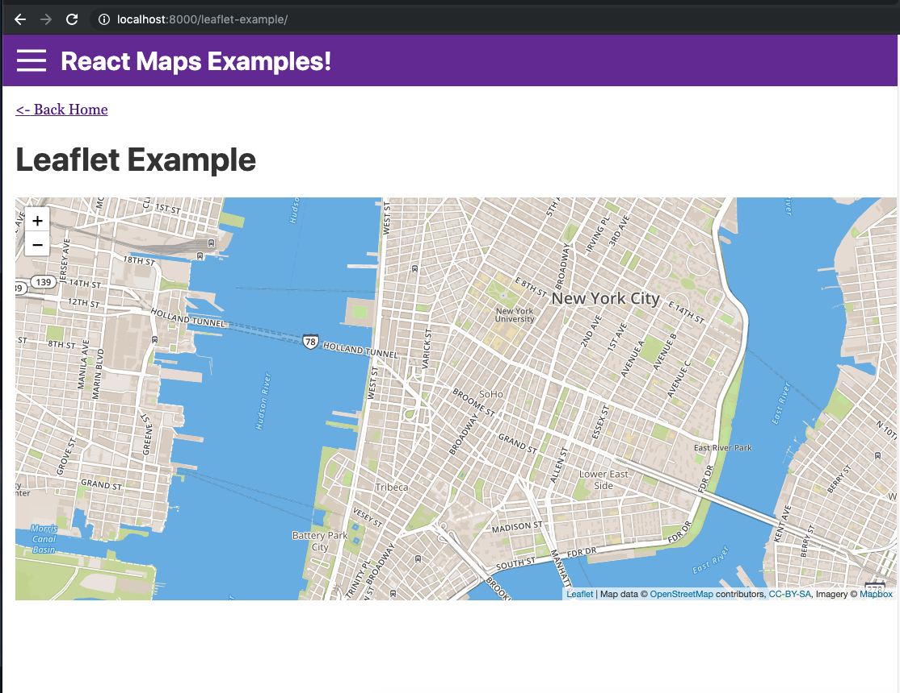

# React Maps Examples

Some examples of displaying maps with JavaScript.

- ### [Leaflet](https://leafletjs.com/)




## (Lack of) Live Demo
Unfortunately, this one is difficult to host live without publicly exposing all my api keys. :(

The best way to use this project is get follow the setup guide below to key api keys, create your .env.development file, and then run the development server. 


## Env.development file
Create a new file in the root of the project named `.env.development`, and put your environment variables here. Follow the `.env.development_SAMPLE` file to know what names to give the envionment variables. 

- Leaflet: uses a "Mapbox access token" which you can get [here](https://account.mapbox.com/access-tokens).

## Get API Keys

For each third party mapping supplier you'll 


## Usage


1) install dependencies

```
npm install
```

2) start local dev server

```
npm start
```

3) formatting and linting

Formatting and linting is done with [Prettier](https://prettier.io/) and [Eslint](https://eslint.org/)

To fix all lint & formatting issues run:
```
npm run format 
```


## Motivation
A lot of my friends have been trash talking "maps in the browser" saying that it can only be done well on a native app. This web app is meant to demo different JavaScript mapping libraries and really put them to the test to se how shitty (or not) they really are. ;)


## Libraries Displayed 

- Leaflet - https://leafletjs.com/

  ✅ Display a map!
  - Display a marker.

- [TODO!!] Google maps - https://developers.google.com/maps/documentation/javascript/tutorial

- [TODO!!] Open Layers - https://openlayers.org/

- [TODO!!] Bing Maps - https://docs.microsoft.com/en-us/bingmaps/v8-web-control/

- ...feel free to add more! 

## Contributing

Feel free to add examples with other maps libraries that have not yet been implemented here, and fee free to open pull requests with the examples!


## Scaffolding

This project was scaffolded with the [gatsby-starter-redux](https://www.gatsbyjs.org/starters/caki0915/gatsby-starter-redux/) template:

```
npx gatsby new my-redux-starter https://github.com/caki0915/gatsby-starter-redux
```

Some included config files:


-  **`.prettierrc`**: This is a configuration file for [Prettier](https://prettier.io/). Prettier is a tool to help keep the formatting of your code consistent.

-  **`gatsby-browser.js`**: This file is where Gatsby expects to find any usage of the [Gatsby browser APIs](https://www.gatsbyjs.org/docs/browser-apis/) (if any). These allow customization/extension of default Gatsby settings affecting the browser.

-  **`gatsby-config.js`**: This is the main configuration file for a Gatsby site. This is where you can specify information about your site (metadata) like the site title and description, which Gatsby plugins you’d like to include, etc. (Check out the [config docs](https://www.gatsbyjs.org/docs/gatsby-config/) for more detail).

-  **`gatsby-node.js`**: This file is where Gatsby expects to find any usage of the [Gatsby Node APIs](https://www.gatsbyjs.org/docs/node-apis/) (if any). These allow customization/extension of default Gatsby settings affecting pieces of the site build process.

-  **`gatsby-ssr.js`**: This file is where Gatsby expects to find any usage of the [Gatsby server-side rendering APIs](https://www.gatsbyjs.org/docs/ssr-apis/) (if any). These allow customization of default Gatsby settings affecting server-side rendering.
